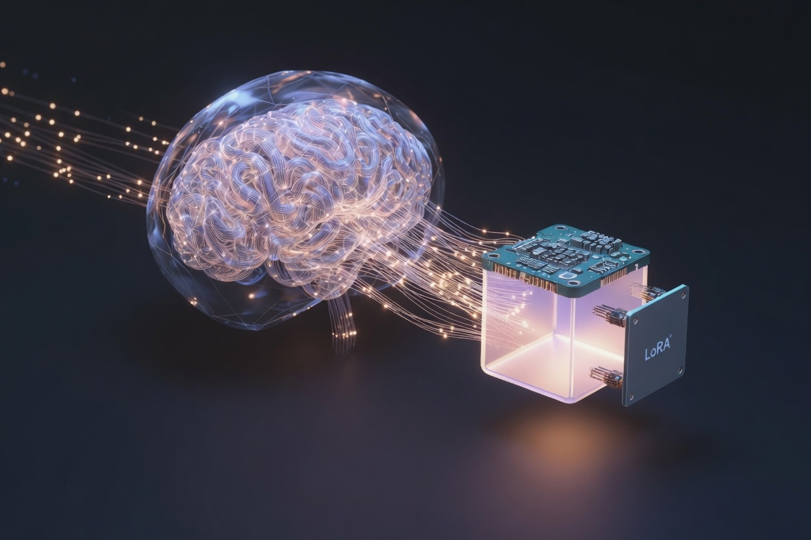

# Vibe Reinforcement Fine-Tuning — SFT on Agent Traces



**Imitate first. Reinforce second. Keep the weights open.**

Minimal, reproducible lab for the first rung of [Hugging Face–style Training Agents](https://www.youtube.com/watch?v=rNgUoH7Wbv8):

1. Load **agent traces** (multi-turn tool sessions)  
2. Convert to **prompt / completion** rows  
3. **LoRA / QLoRA SFT** on a small **open-weights** model with **completion-only loss** (mask the prompt)  
4. Check **format correctness**  
5. **Chat** with the fine-tuned agent (simulated tools)

Designed for a **free Google Colab T4**. No mystery steps—clone, open the notebook, run.

| | |
|--|--|
| **Default student** | [`Qwen/Qwen2.5-1.5B-Instruct`](https://huggingface.co/Qwen/Qwen2.5-1.5B-Instruct) (open weights) |
| **Method** | TRL `SFTTrainer` + PEFT LoRA + 4-bit QLoRA |
| **Data in repo** | 12 synthetic traces → 24 prompt–completion examples |
| **Article** | [`BLOG.md`](BLOG.md) — vibe RFT, distillation, masking, open weights vs open source |

---

## 60-second start (Google Colab — recommended)

1. Open the notebook in Colab:

   **[Open `colab_sft_agent_traces.ipynb` in Colab](https://colab.research.google.com/github/cobusgreyling/vibe-rft-agent-sft/blob/main/colab_sft_agent_traces.ipynb)**

   Or: upload `colab_sft_agent_traces.ipynb` from this repo → Colab.

2. **Runtime → Change runtime type → GPU → T4** (or any GPU).

3. **Runtime → Run all**.

4. Expect roughly:
   - install + model download: a few minutes  
   - ~30 SFT steps: ~2–5 minutes on T4  
   - format eval + optional chat demos at the end  

> **Tip:** If training crashes with  
> `NotImplementedError: ... not implemented for 'BFloat16'`,  
> set `fp16=False` and `bf16=False` in `SFTConfig` (the working notebook already does this).

---

## What you will learn

| Idea | In one line |
|------|-------------|
| **Vibe RFT** | Agent harness builds/runs the pipeline; you steer intent and read metrics |
| **Open weights** | You can download the student parameters and attach LoRA (not a closed chat API) |
| **Behavior distillation** | Teacher traces → small student imitates tool format & multi-turn habits |
| **Completion-only loss** | Model *reads* the prompt; loss only on assistant completions |
| **LoRA** | Small adapter file sits on a frozen/quantized base—you save the adapter, not a full 1.5B retrain |

```
  Teacher traces  →  prompt/completion  →  mask prompt / grade completion
                                              │
                                              v
                                    LoRA on open-weights student
                                              │
                                              v
                                    format eval + chat loop
```

---

## Repo layout

```
vibe-rft-agent-sft/
├── assets/header.jpg              # README hero
├── colab_sft_agent_traces.ipynb   # ★ working end-to-end Colab notebook
├── BLOG.md                        # long-form explanation
├── requirements.txt
├── run.sh                         # local CLI shortcuts
├── data/
│   ├── example_traces.jsonl       # 12 synthetic agent sessions
│   └── prompt_completion.jsonl    # 24 expanded training rows
└── src/
    ├── convert_traces.py          # traces → prompt/completion
    ├── demo_masking.py            # see labels=-100 (CPU)
    ├── train_sft.py               # LoRA SFT (TRL)
    ├── evaluate_format.py         # format correctness
    ├── chat_agent.py              # multi-turn chat + fake tools
    └── test_convert.py            # unit tests (no GPU)
```

---

## Local path (GPU recommended for train)

```bash
git clone https://github.com/cobusgreyling/vibe-rft-agent-sft.git
cd vibe-rft-agent-sft

python3 -m venv .venv
source .venv/bin/activate   # Windows: .venv\Scripts\activate
pip install -r requirements.txt

# 1) Convert + tests (CPU fine)
./run.sh convert
# or:
python src/convert_traces.py
python src/test_convert.py -v

# 2) Optional: visualize completion-only masking
python src/demo_masking.py

# 3) Train LoRA SFT (needs GPU for a sane runtime)
python src/train_sft.py --max-steps 30

# 4) Format eval (base + adapter)
python src/evaluate_format.py --adapter outputs/lora-sft

# 5) Chat with simulated tools
python src/chat_agent.py --adapter outputs/lora-sft
```

### Useful flags

```bash
# Another small open-weights model (Gemma is gated — HF login required)
python src/train_sft.py --model google/gemma-2-2b-it --max-steps 30

# Score base model only (no adapter)
python src/evaluate_format.py --base-only

# One-shot chat prompt
python src/chat_agent.py --adapter outputs/lora-sft --once "List files under ./data"
```

---

## Pipeline in plain English

### 1. Traces

Each line in `data/example_traces.jsonl` is one multi-turn agent session:

`system` → `user` → `assistant` (maybe a tool call) → `tool` → `assistant` (final answer) …

### 2. Expand to prompt / completion

Every **assistant** turn becomes one training row:

- **prompt** = everything before that turn  
- **completion** = that assistant message  

12 traces → **24** examples in this repo.

### 3. Train / hold-out

Default split ~**85% train / 15% eval** (here: **20 / 4**).  
Hold-out is only for measuring loss—not for updating weights.

### 4. Masking (completion-only loss)

```
  [ prompt tokens | completion tokens ]
  [  MASK loss    |   SUPERVISE       ]   labels: -100 vs real token ids
```

The model still **sees** the prompt. It is only **graded** on the completion.  
That is how we teach *agent replies*, not “regenerate the user message.”

### 5. LoRA on open weights

You need **downloadable weights** (open weights). A closed chat API is not enough to attach LoRA yourself.

```
  frozen/4-bit base  +  small LoRA adapter  =  your fine-tuned student
                         ↑
                    what you save under outputs/lora-sft/
```

### 6. Eval & use

- **Format eval** — tool syntax, non-empty answers, no role leaks  
- **Chat** — parse `invoke tool … with … is …`, inject fake tool results, continue the turn  

---

## Is 20 training examples enough?

| Goal | Enough? |
|------|---------|
| Learn the pipeline / blog demo | **Yes** |
| Nudge tool-call **format** | Often **yes** on a narrow style |
| Production coding agent | **No** — need far more diverse traces |

Real agent SFT usually uses hundreds to tens of thousands of trajectories. This repo is the **minimum reproducible baseline**.

---

## Requirements

- Python 3.10+  
- For train/eval/chat with the model: CUDA GPU recommended (Colab T4 works)  
- Packages: see `requirements.txt` (`torch`, `transformers`, `trl`, `peft`, `bitsandbytes`, …)

---

## Related reading

- [`BLOG.md`](BLOG.md) — Vibe Reinforcement Fine-Tuning (full write-up)  
- [TRL SFTTrainer — completion-only loss](https://huggingface.co/docs/trl/en/sft_trainer#train-on-completion-only)  
- [TRL dataset formats](https://huggingface.co/docs/trl/en/dataset_formats)  
- HF Training Agents (Session 1) — SFT on coding-agent traces  

---

## License

MIT — see [`LICENSE`](LICENSE).  
Sample traces are synthetic and free to reuse for teaching.  
Base models have their own licenses (check the Hugging Face model card).

---

## Acknowledgments

Inspired by the Hugging Face **Training Agents** SFT-on-traces workflow and the broader “vibe fine-tuning” idea: agent harness builds the loop; you own the open-weights student.
